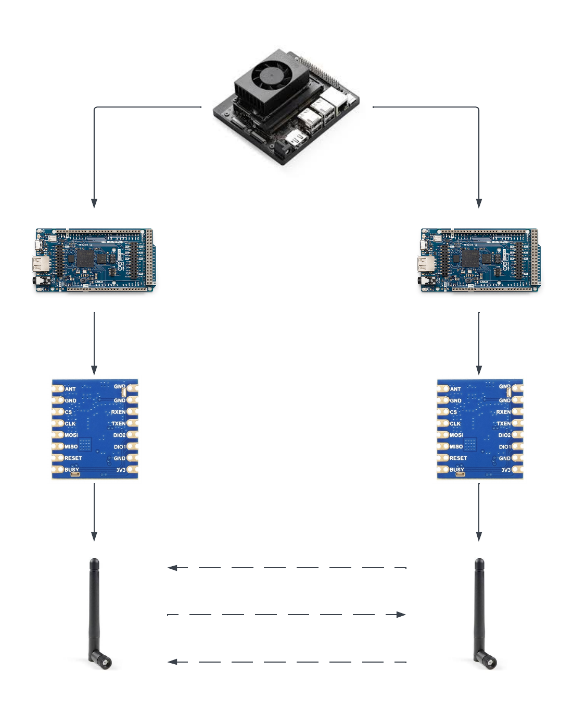
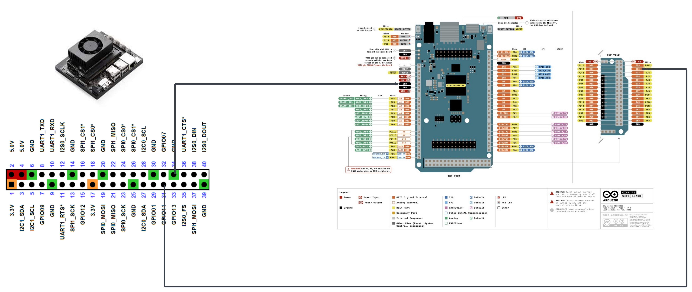
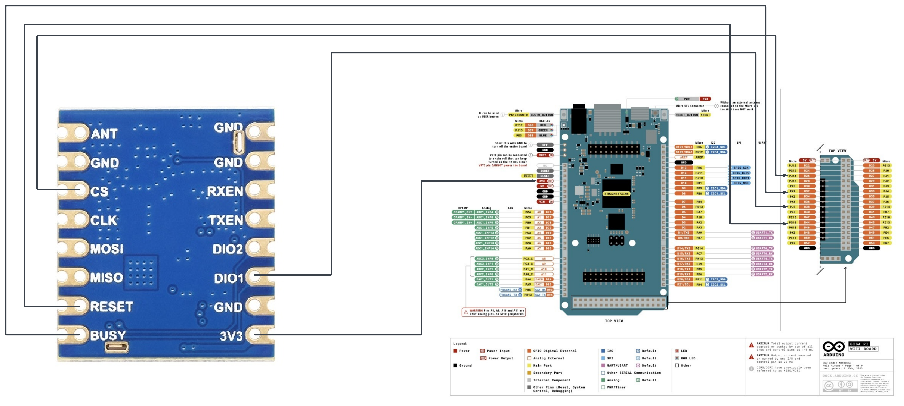

# Lorping: (Lo)Ra F(r)equency Hop(ping)

Lorping is an experimental implementation of time-synchronized frequency hopping for LoRa and FSK using the Semtech SX1262 transceiver. Two SX1262 radios share a predefined frequency-hop table and synchronized timing source, allowing both the transmitter and receiver to change operating frequency according to the same hop schedule.

The project uses Arduino Giga R1 WiFi boards to control the SX1262 radios and a Jetson Orin Nano to provide synchronized timing pulses. The system demonstrates frequency-hopped point-to-point communication and provides automated tests for data networking and audio transmission over both LoRa and FSK.

## High Level Diagram

Setup and instructions can be found below. This setup consists of a Jetson Orin Nano connected via GPIO to two Arduino Giga R1 Wifi boards. Each Giga board is then connected over SPI to a Waveshare Core1262 HF LoRa Module. Each Core1262 module is equipped with a uFL -> SMA Antenna.

In this experiment, the Jetson Orin Nano behaves as the shared time source for each Giga board, off of which they will base their hop schedule and timing. One Giga board acts as the transmitter, and the other behaves as a receiver. Your host computer should be connected to the transmitting Giga over serial, allowing easy verification of the transmit/receive LoRa path on user input strings. 

### Jetson PPS -> Rx Giga Board Setup

The Jetson Orin Nano is connected over GPIO to each Giga board. The receiving Giga board has these connections in my setup, although this can be altered to fit whatever pins you have available.

`Jetson GPIO13 Pin 33 <-> Arduino Giga GPIO D25` \
`Jetson GND Pin 39 <-> Arduino Giga GND`

### Jetson PPS -> Tx Giga Board Setup

The Jetson Orin Nano is connected over GPIO to each Giga board. The transmitting Giga board has these connections in my setup, although this can be altered to fit whatever pins you have available.

`Jetson GPIO11 Pin 31 <-> Arduino Giga GPIO D25` \
`Jetson GND Pin 34 <-> Arduino Giga GND`

### Arduino Giga -> Waveshare Core1262 HF LoRa Module Setup

The Giga board is connected over SPI and GPIO to a single SX1262 LoRa Module. A general pin mapping can be see in the following table:

| SX1262   | Arduino GIGA               |
| -------- | -------------------------- |
| 3v3      | 3v3 Out                    |
| GND      | GND                        |
| CLK      | SPI1_SCK                   |
| MOSI     | SPI1_COPI                  |
| MISO     | SPI1_CIPO                  |
| NSS (CS) | Any GPIO                   |
| BUSY     | Any GPIO (input)           |
| DIO1     | Any interrupt-capable GPIO |
| RESET    | Any GPIO                   |

#### Arduino Giga -> Waveshare Core1262 SPI Pins Setup

Image with SPI only connections between Giga and SX1262: TODO

#### Arduino Giga -> Waveshare Core1262 Control Pins Setup

## Testing and Verification

Point to point networking can be demonstrated uses `ping` and `curl`, with LoRa as the physical network layer and can be seen here: [Tun Testing](test/host_computer/tun_ping_test/)

Assuming everything is setup correctly, you can also run `sudo ./test/auto_test.sh` which will automatically setup the tunnel networking, serial connections, and routes, before attempting a `ping` accross you boards.

#### Automated Testing Coverage Matrix

The following tables represent what can be automatically tested using scripts from the `test` folder:

| LoRa | Non-Hopping | Hopping |
| --- | --- | --- |
| Ping | :white_check_mark: | :white_check_mark: |
| Curl | :white_check_mark: | :x: |
| Audio | :white_check_mark: | :white_check_mark: |

| FSK | Non-Hopping | Hopping |
| --- | --- | --- |
| Ping | :white_check_mark: | :white_check_mark: |
| Curl | :white_check_mark: | :white_check_mark: |
| Audio | :white_check_mark: | :white_check_mark: |

## Future work and improvements

- Allow variable param setting
    - Hop Rate
    - Custom Hop Table
- GPS PPS Source
- Board agnostic code
- Libraries are all relying on imports of the main .ino, it shouldnt be like this
- Build in docker container