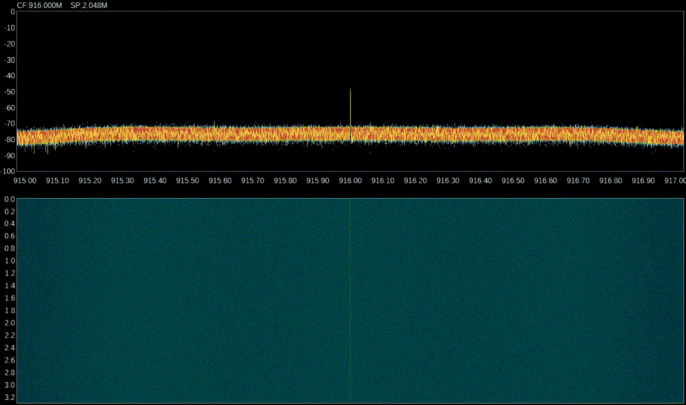

# Examples

## Ping

Any hopping pattern may be used, with simple hop slot incrementing shown below:

*Spectrum analyzer and waterfall visualization of a 10Hz frequency-hopped `ping -c 10 -W 2000 10.99.0.2` command between two LoRa network peers*

A pseudo-random pattern can also be used, and verified with tcpdump:

*Spectrum analyzer and waterfall visualization of a 30Hz frequency-hopped `ping -c 10 -W 2000 10.99.0.2` command between two LoRa network peers*